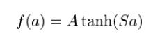

# LeNet-5
A modern implementation of the deep convolutional neural network called "LeNet-5" described in the paper "Gradient-Based Learning Applied to Document Recognition" in PyTorch.


## Results
LeNet-5 (modern) after 20 epochs:

```text
(train set)     epoch: 19       loss: 0.0034    acc: 0.9990     mcr: 0.0010     correct: 59939  miss: 61 
```
Trained (20 epochs) LeNet-5 on testing set:

```text
(test set)      loss: 0.0462    acc: 0.9882     mcr: 0.0118     correct: 9882   miss: 118
```


## Notes

### Funfact
LeNet-5 was in commercial use in the NCR Corporation line of check recognition systems for the banking industry. It read millions of checks per month in several banks across the US

### Modern LeNet-5

---

### Input
Input are (32 x 32) greyscale images, where the caracters are at most (20 x 20) pixels centered in a (28 x 28) field (therefore i used normal (28 x 28) MNIST images with padding=2). The pixels are between [0, 1].

### Layer C1
Layer C1 is a convolutional layer.

* **Input:** (28 x 28) greyscale images (+ adding manually padding=2, resulting in (32 x 32))

* **Feature maps:** 6

* **Kernel size:** (5 x 5)

* **Stride:** 1

* **Output:** (N x 6 x 28 x 28)

* **Trainable parameteres:** 6 * 5 * 5 + 6 = 156

* **Connections:** 28*28*((6 * 5 * 5) + 6) = 122'304

### Layer S2
Layer S2 is a subsampling layer with 6 feature maps of size (14 x 14).

* **Input:** (N x 6 x 28 x 28)

* **Sampling area:** (2 x 2)

* **Stride:** 2

* **Output:** (N x 6 x 14 x 14)

* **Trainable parameteres:** 0

* **Connections:** (2 * 2 * 6 * 14 * 14) = 4'704

### Layer C3

* **Input:** (N x 6 x 14 x 14)

* **Stride:** 2

* **Output:** (N x 16 x 10 x 10)

* **Trainable parameters:** (6 * 16 * 5 * 5) + 16 = 2'416

* **Connections:** (10 * 10 * 16 * 5 * 5) + 16 * 10 * 10 = 41'600

### Layer S4

* **Input** (N x 16 x 10 x 10)

* **Sampling area:** (2 x 2)

* **Stride:** 2

* **Output:** (N x 16 x 5 x 5)

* **Trainable params:** 0 = 0 

* **Connections:** (2 * 2 * 16 * 5 * 5) = 1'600

### Layer C5

* **Input** (N x 16 x 10 x 10)

* **Output** (N x 120) (after flatten)

* **Trainable params:** (120 * 16 * 5 * 5) + 120 = 48'120

* **Connections:** (120 * 16 * 5 * 5) + 120 = 48'120

### Layer F6

* **Input** (N x 120)

* **Output** (N x 84)

* **Trainable params:** (120 * 84) + 84 = 10'164

* **Connections:** (120 * 84) + 84 = 10'164

### Output layer

* **Input** (N x 84)

* **Output** (N x 10)

* **Trainable params:** (84 * 10) + 10 = 850

* **Cnnections:** (84 * 10) + 10 = 850

Resulting in:                                                        

**Trainable params:** 61'706

**Connections:** 229'342

### Activations
As in classical neural networks, units in layers up to F6 compute the dot product between thier input
and thier weight matrix, to which a bias is added. This weighted sum is passed throw a activation function.

The activation function is tanh.

### Loss-Function
The loss function is cross entropy between input logits and target.

### Optimizer
I usded Adam, a method for stochastic optimization.

### Original LeNet-5

---

### Input

Input are (32 x 32) greyscale images, where the caracters are at most (20 x 20) pixels centered in a (28 x 28) field (therefore i used normal (28 x 28) MNIST images with padding=2). The pixels are between [-0.1, 1.175] where the background level (white) corresponds to -0.1 and foreground level (black) corresponds to 1.175. 

### Layer C1
Layer C1 is a convolutional layer.

* **Input:** (32 x 32) greyscale images 

* **Feature maps:** 6

* **Kernel size:** (5 x 5)

* **Stride:** 1

* **Output:** (N x 6 x 28 x 28)

* **Trainable parameteres:** 6 * 5 * 5 + 6 = 156

* **Connections:** (6 * 28 * 28 * 5 * 5)(kernel) + (28 * 28 * 6)(bias) = 122'304

### Layer S2
Layer S2 is a subsampling layer with 6 feature maps of size (14 x 14).

* **Input:** (N x 6 x 28 x 28)

* **Sampling area:** (2 x 2)

* **Stride:** 2

* **Output:** (N x 6 x 14 x 14)

* **Trainable parameteres:** 6 + 6 = 12

* **Connections:** (2 * 2 * 6 * 14 * 14) + (6 * 14 * 14) = 5'880

It could be achieved like this:

```python
import torch
import torch.nn as nn
import torch.nn.functional as F


class Subsampling(nn.Module):
    """
    Represents layer S2 and S4 in LeNet-5 
    
    Subsampling layer with 6 feature maps of size (14 x 14).
    Each unit in the feature map is connected to a (2 x 2) neighborhood in the corresponding feature map C1.
    The four input to a unit in S2 are added, then multiplied by a trainable parameter and a bias is added.
    """ 

    def __init__(
            self, in_channels: int,
            kernel_size: int,
            stride: int) -> None:
        super().__init__()

        self.kernel_size = kernel_size
        self.stride = stride

        self.kernel = torch.ones(
            (in_channels, in_channels, self.kernel_size, self.kernel_size))

        self.coef = nn.Parameter(torch.rand((in_channels, 1, 1)))
        self.bias = nn.Parameter(torch.zeros((in_channels, 1, 1)))

    def forward(self, x: torch.Tensor) -> torch.Tensor:
        out = F.conv2d(input=x, weight=self.kernel, stride=self.stride)
        out = out * self.coef + self.bias
        return out
```


### Layer C3
Layer C3 is a convolutional layer with 16 feature maps. Each unit in each feature map is connnected to several (5 x 5) neighborhoods at identical locations in a subset of S2's feature maps. Table T1 shows the selected featuremaps from S2.

* **Input:** (N x 6 x 14 x 14)

* **Feature maps:** 16

* **Kernel size:** (5 x 5)

* **Stride:** 1

* **Output:** (N x 16 x 10 x 10)

* **Trainable parameteres:** (3 * 6 * 5 * 5) + (6 * 5 * 5 * 4) + ( 3 * 5 * 5 * 4) + (5 * 5 * 6) + 16 = 1516

* **Connections:** ((6 * 10 * 10 * 5 * 5 * 3)(weight) + (6 * 10 * 10)(bias)) + ((6 * 10 * 10 * 5 * 5 * 4)(weight) + (6 * 10 * 10)(bias)) ((3 * 10 * 10 * 5 * 5 * 4)(weight) + (3 * 10 * 10)(bias)) + ((1 * 10 * 10 * 5 * 5 * 6)(weight) + (1 * 10 * 10)(bias)) = 151'600


It could be achieved like this:

```python
import torch
import torch.nn as nn


class LayerC3(nn.Module):
    """
    Represents layer C3 in LeNet-5, its a convolutional layer with 16 feature maps.
    Each unit in the feature map is connected to several (5 x 5) neighborhoods of identical locations,
    in a subset of S2's feature maps.

    +---+---+---+---+---+---+---+---+---+---+---+---+---+---+---+---+---+
    |   | 0 | 1 | 2 | 3 | 4 | 5 | 6 | 7 | 8 | 9 |10 |11 |12 |13 |14 |15 |
    +---+---+---+---+---+---+---+---+---+---+---+---+---+---+---+---+---+
    | 0 | X |   |   |   | X | X | X |   |   | X | X | X | X |   | X | X |
    | 1 | X | X |   |   |   | X | X | X |   |   | X | X | X | X |   | X |
    | 2 | X | X | X |   |   |   | X | X | X |   |   | X |   | X | X | X |
    | 3 |   | X | X | X |   |   | X | X | X | X |   |   | X |   | X | X |
    | 4 |   |   | X | X | X |   |   | X | X | X | X |   | X | X |   | X |
    | 5 |   |   |   | X | X | X |   |   | X | X | X | X |   | X | X | X |
    +---+---+---+---+---+---+---+---+---+---+---+---+---+---+---+---+---+
    Each column indicates which feature map in S2 are combined
    by the units in a particular feature map of C3.
    
    Learnable parameters: 
    W1: 6 * 5 * 5 * 3 + 6 = 456
    W2: 6 * 5 * 5 * 4 + 6 = 606
    W3: 3 * 5 * 5 + 4 + 3 = 303
    W4: 1 * 5 * 5 * 6 + 1 = 151
    + -------------------------
                          = 1516
    """ 
    def __init__(self):
        super().__init__()

        self.conv1 = nn.Conv2d(
            in_channels=18,
            out_channels=6,
            kernel_size=5,
            groups=6,
            bias=True)

        self.conv2 = nn.Conv2d(
            in_channels=24,
            out_channels=6,
            kernel_size=5,
            groups=6,
            bias=True)

        self.conv3 = nn.Conv2d(
            in_channels=12,
            out_channels=3,
            kernel_size=5,
            groups=3,
            bias=True)

        self.conv4 = nn.Conv2d(
            in_channels=6,
            out_channels=1,
            kernel_size=5,
            groups=1,
            bias=True)

        self.ids1 = torch.Tensor(
            [0, 1, 2, 1, 2, 3, 2, 3, 4, 3, 4, 5, 0, 4, 5, 0, 1, 5]).long()

        self.ids2 = torch.Tensor(
            [0, 1, 2, 3, 1, 2, 3, 4, 2, 3, 4, 5, 0, 3, 4, 5, 0, 1, 4, 5, 0, 1, 2, 5]).long()

        self.ids3 = torch.Tensor(
            [0, 1, 3, 4, 1, 2, 4, 5, 0, 2, 3, 5]).long()
        
        self.ids4 = torch.Tensor([0, 1, 2, 3, 4, 5]).long()

    def forward(self, x: torch.Tensor) -> torch.Tensor: 
        out1 = self.conv1(x[:, self.ids1, :, :,])
        out2 = self.conv2(x[:, self.ids2, :, :,])
        out3 = self.conv3(x[:, self.ids3, :, :,])
        out4 = self.conv4(x[:, self.ids4, :, :,])
        out = torch.cat((out1, out2, out3, out4), dim=1)
        return out
```

### Layer S4

* **Input:** (N x 16 x 10 x 10)

* **Sampling area:** (2 x 2)

* **Stride:** 2

* **Output:** (N x 16 x 5 x 5)

* **Trainable parameteres:** 16 + 16 = 32

* **Connections:** (2 * 2 * 16 * 5 * 5) + (16 * 5 * 5) = 2'000


### Layer C5
Layer C5 is a convolutional layer.

* **Input:** (N x 16 x 5 x 5)

* **Feature maps:** 120

* **Kernel size:** (5 x 5)

* **Stride:** 1

* **Output:** (N x 120) (after flatten)

* **Trainable parameteres:** (120 * 16 * 5 * 5) + 120 = 48'120

* **Connections:** (120 * 16 * 5 * 5) + 120 = 48'120

### Layer F6

Layer F5 is a fully-connected layer.

* **Input:** (N x 120)

* **Output:** (N x 84)

* **Trainable parameteres:** (120 * 84) + 84 = 10'164

* **Connections:** (120 * 84) + 84 = 10'164

### Output layer
The output layer is composed of Euclidean Radial Basis function units (RBF), one for each class, with 84 inputs each.

The output of each RBF is computed as follows:


* **Input:** (N x 84)

* **Output:** (N x 10)

* **Trainable parameteres:** 0

* **Connections:** 84 * 10 = 840

Resulting in:

* **Trainabble parameteres:** 60'000

* **Connections:** 340'908


### Activations
As in classical neural networks, units in layers up to F6 compute the dot product between thier input
and thier weight matrix, to which a bias is added. This weighted sum is passed throw a activation function.

The activation function is a scaled hyperbolic tangent:



where A is the amplitude of the function and S determines its slope at the origin.
A is choose to be **1.7159**.

### Loss Function


```bibtex
@article{lecun1998gradient,
    title = {Gradient-based learning applied to document recognition},
    author ={Y. Lecun, L. Bottou, Y. Bengio, P. Haffner},
    year = {1998},
    journal={Proceedings of the IEEE},
    publisher={IEEE} 
}
```


